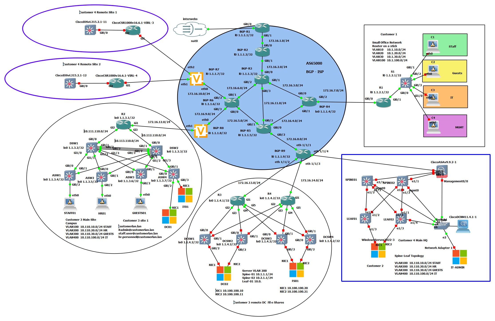

# Large Scale Lab. 

This lab runs in a bare metal instance of GNS3. Server specs are below: 

Server specs: 
  - Dell Poweredge R630
  - 2 22c/44t CPU
  - 256 gb of RAM

# Lab objective
  - Simulate an ISP network using bgp/ospf
  - Simulate multiple customer network infrastructure. 
  - Demonstrate multi-vendor proficiency 
  - Demonstrate multi-protocol network infrastructure design and configuration. 
  - Demonstrate automation skills

# Lab layout 

