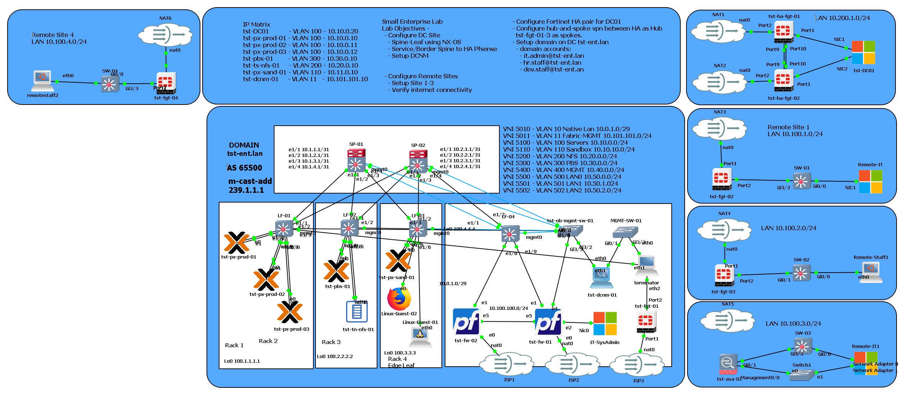

## Modeling Lab for Small Enterprise 
- Modeling Platform: GNS3
- Node Breakdown: 
  - 2 pfsense HA firewalls
  - 2 spine router/l3
  - 4 leaf/tor switches - 1 edge leaf
  - 4 proxmox type-1 hypervisor 3 node cluster / 1 sandbox
  - 1 proxmox backbup server
  - 1 truenas nfs storage server
  - 1 management switch 
  - 1 windows 11 sys admin node
  - 1 terminal/linux node
  - 1 container test node

